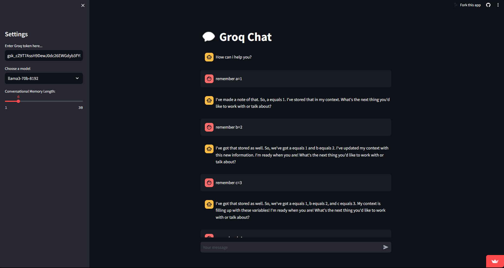

# Groq Chat
Chat Application with Groq API and Langchain Chat Memory




# Installation Steps
```
pip install -r requirements.txt
```


# Usage
- Create Account on groq at https://console.groq.com/
- Create API key at https://console.groq.com/keys
- Paste API key in WEB UI and Press Enter.
- Happy Chatting with faster inference speeds by Groq

